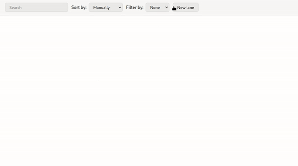

# Tasks.md
A self-hosted file based task management board that supports Markdown syntax.



## Features
- Create cards, lists and tags in a modern and responsive interface;
- Write cards as Markdown files;
- Easy to install with a single Docker image;
- Light and dark themes synced with operating system settings;
- Heavy customizable with 3 default color themes (Adwaita, Nord and Catppuccin);
- Support for subpath based reverse-proxy with a environment variable for base path;

## Installation
Via Docker:
```
docker run -d \
  --name tasks.md \
  -e TZ=Asia/Tokyo \
  -e TITLE="My tasks board" `#optional` \
  -e BASE_PATH=/tasks `#optional` \
  -p 80:80 \
  -v /path/to/cards/:/api/files \
  -v /path/to/styles/:/stylesheets `#optional \
  --restart unless-stopped \
  baldissaramatheus/tasks.md
```
## Customize
All CSS files are available in the public stylesheets directory, which can be mounted as a docker volume. It already comes with 3 color themes: [Adwaita](https://gnome.pages.gitlab.gnome.org/libadwaita/doc/main/named-colors.html), [Nord](https://www.nordtheme.com/) and [Catppuccin](https://github.com/catppuccin/catppuccin). To use them, open the file `/stylesheets/index.css` and change the second line to the path of the color theme you want (they are located under `/stylesheets/color-themes`).

## Technology stack
With the goal of have a good mix of performance and maintainability, the appliaction was built [SolidJS](https://github.com/solidjs/solid) and [Koa](https://github.com/koajs/koa). It also uses [SimpleMDE](https://github.com/sparksuite/simplemde-markdown-editor) for text editing and [serve-static](https://github.com/expressjs/serve-static) for serving the css files as-is.

## Contribute
Feel free to create issues for encountered bugs or to request new features, just make sure to include a proper label. If you want to contribute with its development, select one of the existing issues and create a pull request, it will be reviewed and may be merged with the existing code. 

### Running the source code
Open a terminal instance in the frontend directory and one terminal in the backend directory, then in both of them run `npm install` and `npm start`;
